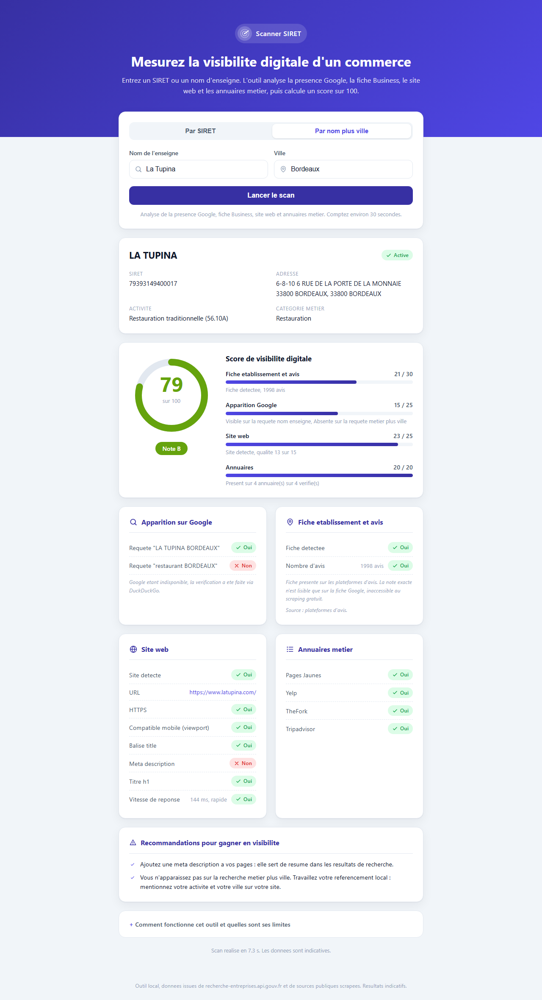

# Scanner SIRET

Outil de diagnostic de visibilite digitale d'un commerce. A partir d'un numero SIRET
ou d'un nom d'enseigne plus une ville, il produit un rapport visuel et un score sur 100.



## Ce que l'outil analyse

- Apparition dans les recherches : requete nom enseigne et requete metier plus ville.
- Fiche etablissement et avis : presence sur les plateformes d'avis (Google Maps,
  TripAdvisor, Yelp), note et nombre d'avis quand ils sont lisibles.
- Site web : detection, HTTPS, compatibilite mobile, balises de base, vitesse.
- Annuaires metier selon le code NAF :
  - restauration : Pages Jaunes, Yelp, TheFork, Tripadvisor
  - coiffure et beaute : Pages Jaunes, Planity, Treatwell
  - autres : Pages Jaunes, Yelp, Google Maps
- Score global sur 100, ponderation : fiche et avis 30, apparition recherche 25,
  site web 25, annuaires 20.
- Recommandations actionnables pour gagner en visibilite.

## Prerequis

- Node.js 18 ou superieur (teste avec Node 24).
- Connexion internet.
- A l'installation, Chromium est telecharge automatiquement pour Playwright (environ 150 Mo).

## Installation

```
npm install
```

La commande declenche aussi `playwright install chromium`.

## Lancer en local

```
npm run dev
```

Deux process demarrent :

- API Express sur http://localhost:3001
- Interface Vite sur http://localhost:5173

Ouvrir http://localhost:5173 dans le navigateur.

## Tests

```
npm test
```

Les tests couvrent les cas critiques hors ligne : SIRET valide, SIRET invalide,
entreprise sans site, entreprise sans fiche etablissement, reponderation du score
quand une source est bloquee.

## Stack

- Interface : React, servie par Vite.
- Serveur : Node et Express.
- Lecture des moteurs de recherche : Playwright (Chromium headless).
- Donnees entreprise : API publique recherche-entreprises.api.gouv.fr.
- Aucune cle API payante.

## Sources de donnees

- recherche-entreprises.api.gouv.fr : API publique gratuite, resolution SIRET et nom
  vers raison sociale, adresse, code NAF, etat administratif. Adossee a la base SIRENE
  de l'INSEE.
- Moteurs de recherche : lecture automatisee via Playwright. L'outil tente Google,
  puis bascule sur DuckDuckGo (moteur principal effectif, le plus stable), puis Bing.
- Une cle Google Programmable Search peut etre branchee (optionnelle, gratuite). Voir
  `.env.example`.

## Limites assumees

- Google bloque la lecture automatisee gratuite de ses pages. L'apparition est donc
  mesuree via DuckDuckGo. Le moteur ayant repondu est indique dans le rapport.
- La note exacte d'une fiche Google n'est lisible que sur la fiche Google elle-meme.
  Elle est affichee quand elle apparait dans les resultats, sinon laissee vide.
  Aucune donnee n'est inventee.
- Une source bloquee est exclue du score, recalcule sur les categories restantes.
- Resultats indicatifs : une photographie de la visibilite en ligne, pas un document
  officiel.

## Pas heberge en ligne

L'outil a besoin d'un serveur (scraping via Playwright), il ne peut donc pas tourner
sur un hebergement statique. Il s'execute en local avec `npm run dev`. Le serveur
ecoute uniquement sur la boucle locale (127.0.0.1).

## Auteur

Construit par Emmanuel Truffaut, Product Builder No-Code et IA.

Vous inspectez le code ? Une question ? Je reponds avec plaisir :
[Emmanuel Truffaut sur LinkedIn](https://www.linkedin.com/in/emmanuel-truffaut-b38b292b7)

Portfolio : https://portfolio.etd-projects.fr
